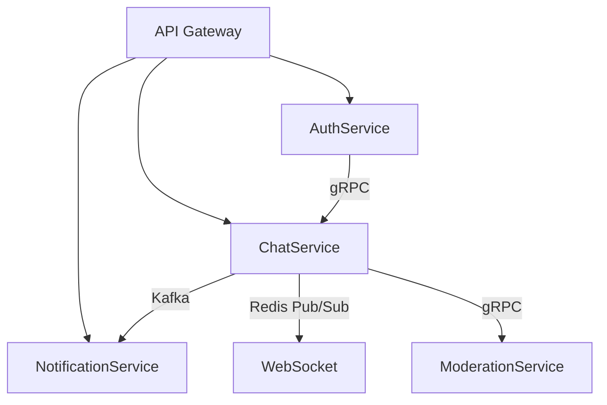

# Архитектура чат-приложения

## Обзор

Этот документ описывает архитектуру масштабируемого чат-приложения с поддержкой личных сообщений, групповых чатов, уведомлений и модерации контента в реальном времени.

## Функциональные требования

1. **Аутентификация/Авторизация**: Безопасный вход и контроль доступа с использованием JWT и gRPC.
2. **Личные сообщения**: Чаты в реальном времени через WebSocket и Redis Pub/Sub.
3. **Комнаты (групповые чаты)**: Событийно-ориентированная архитектура с Kafka.
4. **Уведомления**: Асинхронные push/email-уведомления через Kafka и WebPush.
5. **История сообщений**: Хранение сообщений в MongoDB.
6. **Онлайн-статусы**: Отслеживание присутствия пользователей в реальном времени с помощью Redis.
7. **Модерация контента**: Асинхронная проверка сообщений с использованием Kafka и gRPC.

## Архитектурная диаграмма

## Сервисы и технологии

### 1. AuthService

**Технологии**: gRPC, JWT

**Назначение**: Управление аутентификацией и авторизацией пользователей.

**Обязанности**:

- Регистрация и вход пользователей через REST API.
- Проверка токенов и прав доступа к комнатам через gRPC.

### 2. ChatService

**Технологии**: gRPC, Kafka, Redis, MongoDB

**Назначение**: Основная логика чатов и комнат.

**Обязанности**:

- Создание и управление комнатами через REST API.
- Обработка личных сообщений через Redis Pub/Sub для онлайн-пользователей.
- Обработка сообщений в комнатах через Kafka для масштабируемости.
- Хранение истории сообщений в MongoDB.

### 3. NotificationService

**Технологии**: Kafka, WebPush

**Назначение**: Управление асинхронными уведомлениями.

**Обязанности**:

- Обработка событий чатов из Kafka.
- Отправка push/email-уведомлений пользователям.

### 4. ModerationService

**Технологии**: gRPC, Kafka

**Назначение**: Обеспечение соответствия контента правилам.

**Обязанности**:

- Асинхронная проверка сообщений на запрещённый контент.
- Блокировка пользователей через gRPC.

### 5. WebSocketService

**Технологии**: Redis Pub/Sub

**Назначение**: Доставка сообщений в реальном времени онлайн-пользователям.

**Обязанности**:

- Подписка на каналы Redis для пользовательских сообщений.
- Передача сообщений через WebSocket.

## Инфраструктура и развертывание

### Развертывание в Kubernetes

**Компоненты**:

- **auth-service**: Deployment + Service для аутентификации.
- **chat-service**: Deployment с Horizontal Pod Autoscaler (HPA) для масштабирования.
- **kafka-broker**: StatefulSet для надежной очереди сообщений.
- **redis**: StatefulSet для данных в памяти и Pub/Sub.

**Конфигурация Ingress**:

- `/api/*`: Маршруты к REST-сервисам (AuthService, ChatService).
- `/ws`: Маршрут к WebSocket для сообщений в реальном времени.

## Обоснование технологий

| Технология | Применение | Обоснование |
| --- | --- | --- |
| **gRPC** | Auth ↔ Chat, Chat ↔ Moderation | Низкая задержка, строгая типизация для критически важных операций. |
| **Kafka** | События чатов, уведомления, модерация | Гарантированная доставка и масштабируемость для событийной архитектуры. |
| **Redis** | Онлайн-статусы, WebSocket | Задержка менее миллисекунды для чатов и статуса присутствия в реальном времени. |
| **MongoDB** | История сообщений | Гибкая схема для хранения неструктурированных данных чата. |
| **Kubernetes** | Оркестрация сервисов | Масштабируемость, проверки работоспособности, обновления без простоев. |

## Дополнительные функции
(что еще хочется докрутить после выполнения основного плана)

1. **Голосовые комнаты**:
    - Использование WebRTC с сервером Selective Forwarding Unit (SFU) для голосовой связи с низкой задержкой.
2. **Аналитика активности**:
    - Потоковая обработка событий чата через Kafka в Apache Flink для аналитики в реальном времени (активность пользователей, объем сообщений).
    - Визуализация метрик с помощью дашборда (например, Grafana).